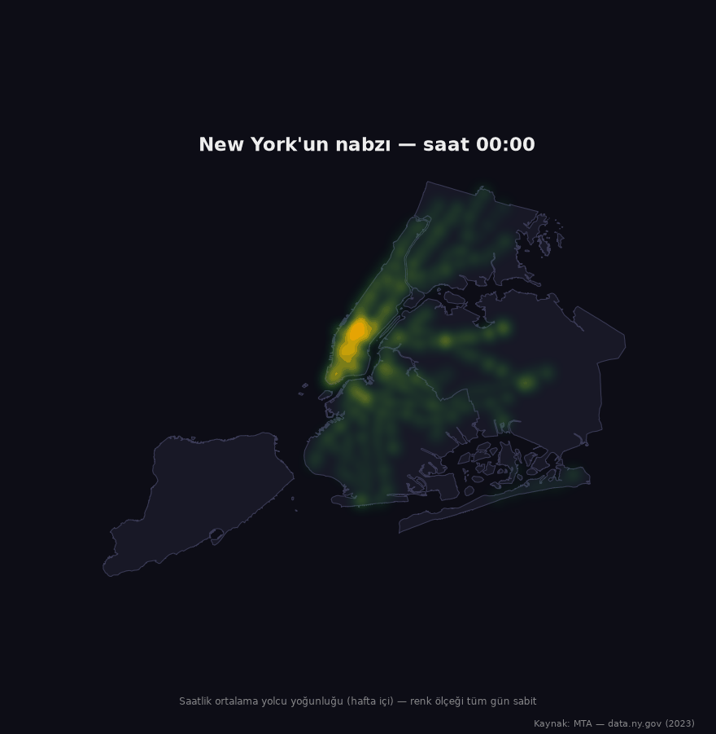
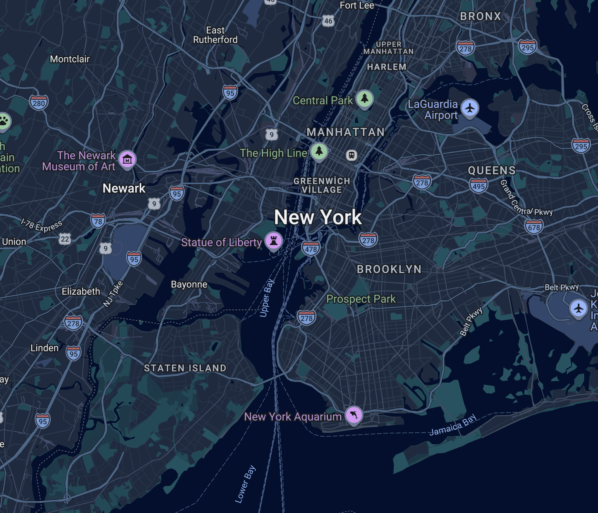

# NYC Analiz
Amaç: Ulaşım verilerini kullanarak yaşam yorumu yapmak. Yorumları grafiğe dökmek.





MTA'in saatlik metro yolculuk verisiyle New York'un günlük ritmi.
2022 başından 2024 Temmuz'una kadar tüm istasyon kayıtları DuckDB ve
Python ile işlendi.


## Grafikler


*New York kaçta uyanıyor — ya da hiç uyuyor mu?*


*Hangi günler "normal" değildi?*


*Hangi borough, hangi istasyon gece yaşıyor?*


*Kim hangi saatte metroda?*


*İstasyonların günlük ritmi kaç tipe ayrılıyor?*

## En yoğun

| Saat | Hafta içi | Hafta sonu |
|------|-----------|------------|
| 00–02 | Greenwich/West Village — W 4 St (A,C,E,B,D,F,M), Christopher St (1) | Lower East Side — Delancey St/Essex St (F,J,M,Z) |
| 03–04 | Washington Heights — Dyckman St (1) | Lower East Side — gece kapanışı |
| 05–09 | Washington Heights & Inwood — 181 St, 191 St, Inwood-207 St (A,1); 86 St (Q) | Harlem — 125 St (A,C,B,D) |
| 10–13 | Hunter College (6), Doğa Tarihi Müzesi (C,B) | Upper West/East Side — 96 St (1,2,3), 86 St (Q) |
| 14–16 | Doğa Tarihi Müzesi (C,B) — müze çıkışı | Canal St (J,N,Q,R,W,Z,6), Broadway-Lafayette (B,D,F,M) — alışveriş |
| 17–18 | Midtown ofisleri — 5 Av/53 St (E,M), Rockefeller Ctr (B,D,F,M) | Rockefeller Ctr, Hudson Yards (7) |
| 19–22 | SoHo — Prince St (R,W); East Village — 3 Av (L) | Village — W 4 St; Broadway tiyatroları — 50 St (1) |
| 23 | Village geri devralıyor — W 4 St | Village — W 4 St |

## Veri

- Kaynak: [MTA Subway Hourly Ridership](https://data.ny.gov/Transportation/MTA-Subway-Hourly-Ridership-2020-2024/wujg-7c2s) (data.ny.gov)

## Çalıştırma

```bash
python3 -m venv venv && source venv/bin/activate
pip install -r requirements.txt

python scriptler/veri_boru_hatti.py 202201 202407   # indir + doğrula + Parquet
python scriptler/make_figures.py 2023               # yıl grafikleri
python scriptler/make_gece_haritasi.py 2023         # istasyon gece haritası
python scriptler/make_gif.py 2023                   # animasyonlu harita
```

## Yapı

```
├── sql/         # DuckDB sorguları
├── kaynak/      # ingest, db, viz
├── scriptler/   # veri boru hattı ve grafik/harita üreticileri
├── veri/        # işlenmiş veri (repoda değil)
└── ciktilar/    # grafikler ve haritalar
```
