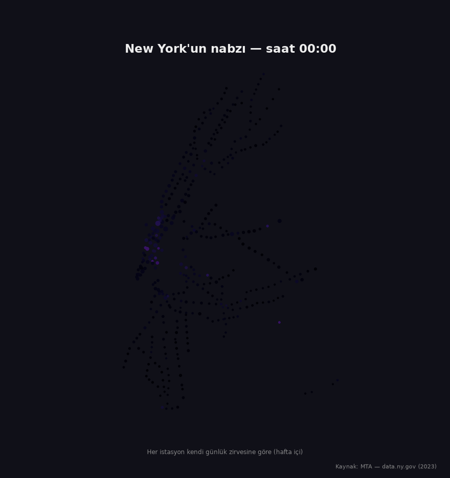
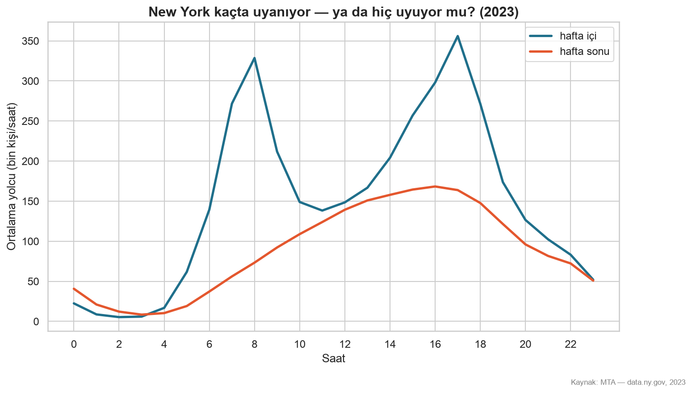
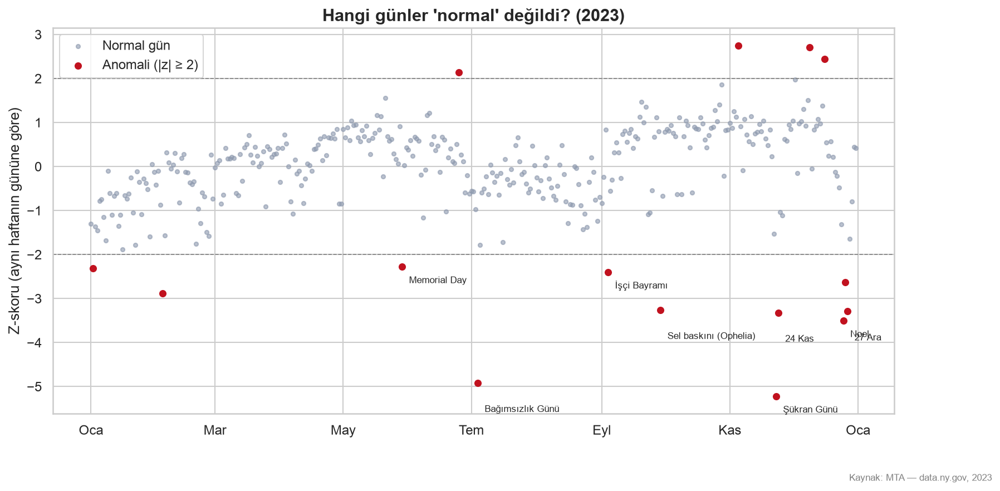
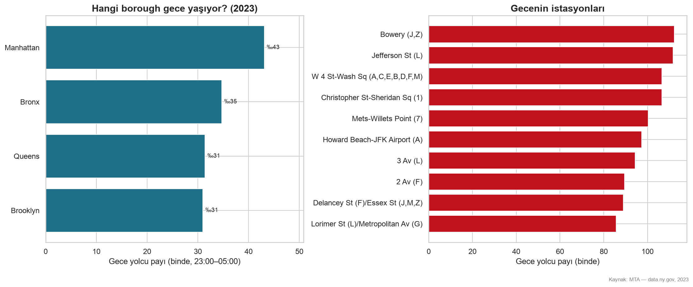
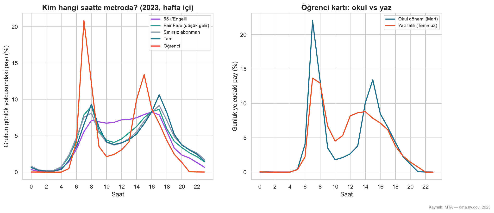
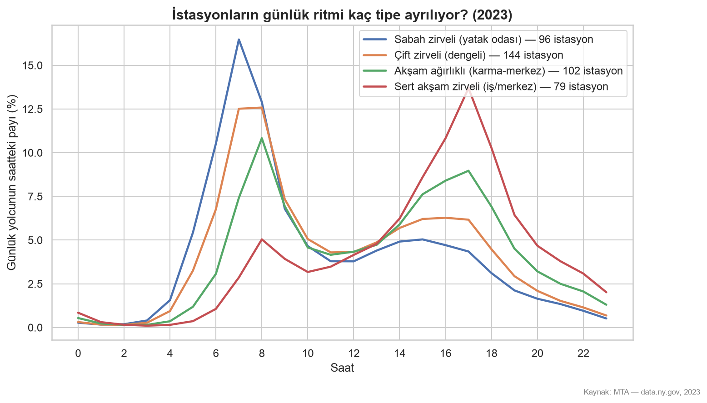

# NYC Analiz



MTA'in saatlik metro yolculuk verisiyle New York'un günlük ritmi.
2022 başından 2024 Temmuz'una kadar tüm istasyon kayıtları DuckDB ve
Python ile işlendi.


## Grafikler


*New York kaçta uyanıyor — ya da hiç uyuyor mu?*


*Hangi günler "normal" değildi?*


*Hangi borough, hangi istasyon gece yaşıyor?*


*Kim hangi saatte metroda?*


*İstasyonların günlük ritmi kaç tipe ayrılıyor?*

İnteraktif gece haritası `ciktilar/haritalar/` altında (indirip tarayıcıda açın).
Tüm yılların grafikleri `ciktilar/grafikler/` altında.

## Veri

- Kaynak: [MTA Subway Hourly Ridership](https://data.ny.gov/Transportation/MTA-Subway-Hourly-Ridership-2020-2024/wujg-7c2s) (data.ny.gov)

## Çalıştırma

```bash
python3 -m venv venv && source venv/bin/activate
pip install -r requirements.txt

python scriptler/veri_boru_hatti.py 202201 202407   # indir + doğrula + Parquet
python scriptler/make_figures.py 2023               # yıl grafikleri
python scriptler/make_gece_haritasi.py 2023         # istasyon gece haritası
python scriptler/make_gif.py 2023                   # animasyonlu harita
```

## Yapı

```
├── sql/         # DuckDB sorguları
├── kaynak/         # ingest, db, viz
├── scriptler/     # veri boru hattı ve grafik/harita üreticileri
├── data/        # işlenmiş veri (repoda değil)
└── ciktilar/     # grafikler ve haritalar
```
